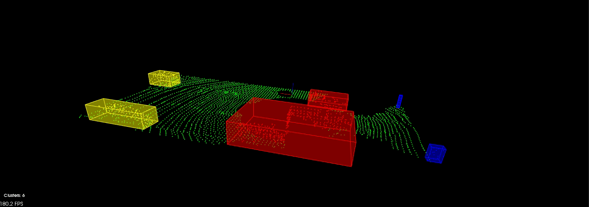

# Sensor Fusion Engineer ND: Task 1

<figure class="image">
	
	<figcaption>Lidar measurement processing with default configuration.</figcaption>
</figure>

### Starting the Program (Simple)
For building and running this program just run the `build_run.sh`:
```bash
$> ./build_run.sh
```

## Task 1: Lidar
This project is my implementation of the solution for the first task in the sensor fusion engineer nanodegree. A dataset with measurements from a car lidar is given. This data set is then processed to extract information about the environment, as for example for obstacle detecion.

### Processing
The processing is done in different steps:
- filtering
- segmentation
- clustering

#### Filtering
This process prepares the input data for further processing. Firstly the data is downsampled using a voxel grid downscampling. Then only the region of interest is chosen based on configuration file. After that on the filtered data the roof of the car is extracted to no interfere with further processing. 
The filtering step essentially lowers the number of measures to allow for faster processing in following steps.

#### Segmentation
The measurements are segmented into two point clouds; **ground plane** and **obstacles**. 
Segmentation is done by using the RANSAC (***RAN**dom **SA**mple **C**onsensus*) algorithm. With RANSAC three random points are chosen which form a plane. Based on the configured *distance tolerance* points on the plane are chosen. The plane with the most inliers is chosen for the ground plane.

#### Clustering
The **obstacles** point cloud from the previous step is further separated into different clusters. The points whose distance to each other is less than the configure **tolerance** are clustered into a separate point cloud representing a real-world object (e.g. another car, cyclist, ...). 

The clustering is done by using the **Euclidean Clustering** algorithm. To optimize this process the points are beforehand arranged into a **KD-Tree** (for 3-dimensional space *K=3* is used).

#### Final Visualization
The clustered objects and the ground plane are then visualized using the pcl visualization. Around each clustered object a box is drawn with the box being defined by the minimal and maximal points in the cluster. 

This process is done for each frame. At the start of processing the frame the configuration from the *src/config.json* is read and used in further processing.

## Installation

### Simple
For building and running this program just run the `build_run.sh`:
```bash
$> ./build_run.sh
```

### Separate Steps 
If you prefer to have more control over the build and run process you can build 
the program with:

```bash
$> cd ~
$> git clone https://github.com/maetulj/SFND_Lidar_Obstacle_Detection.git
$> cd SFND_Lidar_Obstacle_Detection
$> mkdir build && cd build
$> cmake ..
$> make
$> ./lidar_detection
```

## Configuration
The processing can be configured using the file *src/config.json*. This file contains the different parameters for processing and is read at the start of processing each frame:
- **filtering**: This object contains parameters for the filtering step:
	- **voxel_size**: The side of the voxel (voxel has 3 equal sides) represented as a *double*.
	- **min**: The minimal point defining the region of interest.
		- **x**: X-coordinate represented as *double*.
		- **y**: Y-coordinate represented as *double*.
		- **z**: Z-coordinate represented as *double*.
	- **max**: The maximal point defining the region of interest.
		- **x**: X-coordinate represented as *double*.
		- **y**: Y-coordinate represented as *double*.
		- **z**: Z-coordinate represented as *double*.
- **segmentation**: This object contains parameters for the segmentation step.
	- **iterations**: Number of iterations in the RANSAC given as a *int*. 
	- **distance_threshold**: Threshold to count points to the plane given as an *double*.
- **clustering**: This object contains parameters for the clustering step.
	- **tolerance**: Distance tolerance for a point to other points in the cluster to be accounted as belonging to the cluster.
	- **min**: Min number of points for the cluster to be valid.
	- **max**: Max number of points for the cluster to be valid.
- **rooftop**: This object contains parameters for extracting the roof.
    - **min**: Point defining the lower area to extract.
    - **max**: Point defining the upper area to extract.

The configuration is processed using https://github.com/nlohmann/json.